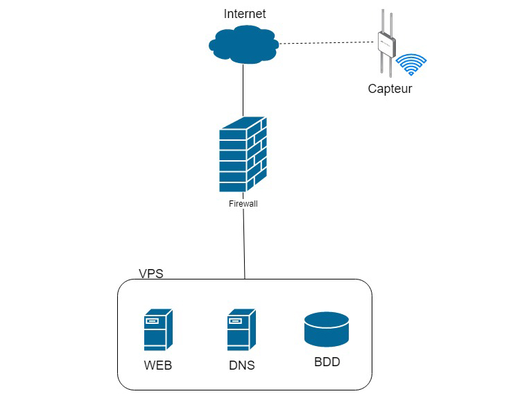

# Description du projet

Ce projet consiste en l'intégration des différents techniques afin d'arriver à un système de partage de graine qui aidera les futurs agriculteurs amateurs.
Le site étant gratuit, nos clients auront la possibilité d'accéder au maximum des ressources mises à leur disposition afin de trouver les graines parfaites pour leur potager.

Un appareil de suivi de la température et de l'humidité de leur serre sera proposé pour tout client désireux de suivre plus en détail leur potager et ainsi optimiser au mieux la pousse et les récoltes.
Cet appareil sera peu encombrant et ne nécessitera que d'un câble d'alimentation ainsi que d'un accès à internet.

## Liens utiles et outils

Concernant ce projet, voici les liens et outils que nous nous servont :

* _**Organisation GitHub**_ : <https://github.com/seed-IT>
* _**Trello**_ : <https://trello.com/b/XEX3CKmq>
* _**Docker Hub**_ : <https://cloud.docker.com/repository/docker/melvinmajor/seed-it>

Nous avons par ailleurs utilisé un groupe de communication privé dans _**Microsoft Teams**_, tout comme _**Clockify**_ comme outil de timesheet.

\pagebreak

# Bilan du Sprint

## Avancement technique

Du point de vue technique, nous avons avancé sur le fonctionnement et sur la structure du site, mais aussi sur le côté Raspberry Pi. La partie concernant l'appareil de suivi (température, humidité et pression atmosphérique) est finie, nous devons juste envoyer les données à notre API.

## Méthodologie et gestion d'équipe

Nous avons instauré le principe de PokerPlanner via Teams afin d'essayer d'avancer malgré les différences d'horaire de chacun. Avant les congés nous avons mis en place une stratégie commune pour avancer le projet dans les grandes lignes. Cela nous a beaucoup aidés, car les petits changements ont été faciles à adapter via Teams.

## Analyse réflexive du fonctionnement du groupe

L'avancement plus rapide que dans les autres sprints, a été possible grâce à l'entraide des équipes de 2. Il y a eu 3 équipes de 2, chacune sur un sujet, et au tour de rôle un membre qui aidait les équipes en difficulté.

\pagebreak

# Objectifs du Sprint

Le nombre de points accordé est lié à la difficultée et, par conséquent, au temps à devoir consacrer pour mener à bien ce _Story_.

## User Stories

* En tant qu'utilisateur du site web _**(enregistré)**_, j'ai la possibilité de déposer une offre d'échange de mes graines.
* En tant qu'utilisateur du site web _**(enregistré ou pas)**_, j'ai la possibilité de voir les régles RGPD du site.
* En tant qu'utilisateur du site web _**(enregistré)**_, j'ai la possibilité de voir l'êtat des graines d'autres membres PiMium.
* En tant que visiteur du site web _**(enregistré)**_, j’ai la possibilité de demander la suppression intégrale de mon compte comme la loi RGPD me le permet.
* En tant que visiteur du site web _**(enregistré)**_, j’ai la possibilité de demander une copie de toutes les informations de mon compte.
* En tant que visiteur du site web _**(enregistré)**_, j’ai la possibilité de souscrire à l’abonnement Premium, PiMium ou de résilier mon abonnement pour revenir à l’offre gratuite.
* En tant que visiteur du site web _**(enregistré et gratuit)**_, j’ai la possibilité d’effectuer 3 échanges de semences par mois.
* En tant que visiteur du site web _**(enregistré et abonnement Premium)**_, j’ai la possibilité d’effectuer 10 échanges de semences par mois.
* En tant que visiteur du site web _**(enregistré et abonnement PiMium)**_, j’ai la possibilité d’effectuer un nombre illimité de semences par mois et recevoir l’appareil de suivi de mon potager.

## Technical Stories

* TS : Finalisation du site web _(Sprint 3, 5 points)_
  * _**Responsable :**_ Hymed Boussaklatan
  * _**Description :**_ Finalisation des pages du site web
  * _**Tâche :**_ Finalisation complète du site internet avec liaison vers la base de données et module de contact
* TS : Mise en place de la partie dynamique du site web _(Sprint 3, 10 points)_
  * _**Responsable :**_ Hymed Boussaklatan
  * _**Description :**_ Intégration des modules connexion/inscription ainsi que tout autre contenu dynamique
  * _**Tâches :**_
    * Intégration des modules de connexion et d'inscription (+ liaison avec la base de données)
    * Mise en place d'un formulaire de contact
    * Intégration de la partie "boutique" pour les membres
* TS : Finalisation de la base de données _(Sprint 3, 7 points)_
  * _**Responsables :**_ Antoine Hoebaer, Nathan Henry, Filipp Shatskiy
  * _**Description :**_ Finalisation de l'implémentation de la base de données
  * _**Tâches :**_
    * Finalisation de la création de la base de données,
    * Intégration dans le service Docker spécifique à la base de données,
    * Liaison avec le site web.
* TS : Avancement du CSS du site web _(Sprint 3, 3 points)_
  * _**Responsable :**_ Antoine Hoebaer
  * _**Description :**_ Avancement sur la partie CSS du site web au fur et à mesure du développement des pages
  * _**Tâche :**_ Ajout des id et classes nécessaires pour les nouvelles pages implémentées
* TS : Commencement de l'appareil de suivi _(Sprint 3, 10 points)_
  * _**Responsables :**_ Constantin Mirica, Melvin Campos Casares
  * _**Description :**_ Préparation de l'appareil et mis en place d'un outil de mesure simple
  * _**Tâches :**_
    * Mise en place de Raspbian CLI sur la Raspberry Pi 4,
    * Ajout des librairies pour la compatibilité entre la Raspberry Pi et le capteur BME280 de Bosch,
    * Création d'un outil de mesure simple.
* TS : Diminution des écritures sur la mémoire de stockage de l'appareil de suivi _(Sprint 3, 3 points)_
  * _**Responsable :**_ Melvin Campos Casares
  * _**Description :**_ Afin d'accroître la durée de vie du stockage de la Raspberry Pi 4, les logs seront redirigé sur RAM et injecté sur le stockage à un rythme moins fréquent
  * _**Tâches :**_
    * Création du ramdisk et déplacement des logs sur RAM,
    * Script de copie des logs sur RAM vers le stockage,
    * Service executant le script avant extinction et redémarrage.
* TS : Commencement de l'API _(Sprint 3, 5 points)_
  **Responsable :** Hubert Van De Walle
  **Description :** Commencement de l'API servant à l'intercommunication entre le site internet et la base de données
  **Tâche :** Création des méthodes GET et POST

## Bug

Le dernier CSS mis en place en fin de Sprint 2 est _Responsive Design_ mais apparemment incompatible avec le service web même si totalement fonctionnel en local.
Antoine Hoebaer est en charge de l'évolution du CSS en attendant que la version finale du site web soit créé.
Melvin Campos Casares reprendra en main le CSS une fois la version finale du site web déployé tant sur GitHub que dans le service web afin de le rendre _Responsive Design_ et attrayant.

* BUG : CSS final du site web adapté à la nouvelle architecture du site web _(Sprint 3-4, 2 points)_
  * _**Responsable :**_ Melvin Campos Casares
  * _**Description :**_ Finalisation de la partie CSS du site web sur base de la version finale du site web développé
  * _**Tâche :**_ Ajout des id et classes nécessaires pour toutes les pages implémentées et la nouvelle structure mise en place

\pagebreak

# Timesheet

Les autres membres du groupe ont travaillé mais n'ont pas fourni à temps leur timesheet.
Cela sera reglé pour le prochain Sprint.

| Nom | Date | Durée | Description |
|-----|------|-------|-------------|
| Nathan | 17/10/2019 | 02:09:34 | Importation de la base de données dans le service sur le VPS |
| Hubert | 17/10/2019 | 00:23:33 | Docker DB |
| Hymed | 17/10/2019 | 01:18:30 | Sécurité + création des comptes |
| Hubert | 17/10/2019 | 00:36:39 | Recherches pour l'API |
| Hymed | 17/10/2019 | 04:56:06 | Framework PHP |
| Hubert & Filipp | 17/10/2019 | 00:19:46 | API : Partie Maven |
| Hymed | 17/10/2019 | 03:22:49 | Sécurité + création des comptes |
| Hymed | 17/10/2019 | 02:10:42 | Framework PHP |
| Nathan | 17/10/2019 | 02:13:00 | Importation de la base de données dans le service sur le VPS |
| Antoine | 19/10/2019 | 01:01:36 | Seed-IT webpage |
| Antoine | 19/10/2019 | 00:21:00 | Seed-IT webpage |
| Nathan | 19/10/2019 | 00:42:00 | Migration du service de la base de données |
| Nathan | 19/10/2019 | 00:57:38 | Mise à jour du service de la base de données |
| Nathan | 19/10/2019 | 00:47:22 | HTML : Informations sur les créateurs |
| Antoine | 19/10/2019 | 00:23:12 | Seed-IT webpage |
| Melvin | 20/10/2019 | 00:12:54 | Soudures du capteur BME280 (Adafruit) |
| Melvin | 20/10/2019 | 01:04:27 | Configuration du Raspberry Pi 4 : activation des interfaces I2C/SPI, Blinka test, installation des drivers du capteur BME280 d'Adafruit et intégration du ventilateur CPU SHIM |
| Melvin | 20/10/2019 | 01:20:11 | Programmation du capteur BME280 |
| Melvin | 21/10/2019 | 01:52:36 | Programmation du capteur BME280 |
| Hymed | 21/10/2019 | 04:26:56 | Framework PHP |
| Antoine | 21/10/2019 | 01:09:35 | Seed-IT webpage |
| Hymed | 21/10/2019 | 05:00:00 | Framework PHP |
| Filipp | 22/10/2019 | 00:41:28 | API Java |
| Melvin | 22/10/2019 | 01:22:02 | Raspberry Pi 4 : DDNS (Dynamic DNS via Duck DNS) + SSH + Port forwarding |
| Hubert | 22/10/2019 | 00:08:00 | Raspberry Pi 4 : Tests réseaux + pare-feu + SSH |
| Nathan | 22/10/2019 | 00:36:12 | Optimisation du service de la base de données |
| Melvin | 22/10/2019 | 00:55:25 | Raspberry Pi 4 : déplacement des logs en RAM + service de recopie en stockage (toutes les 3h + extinction/redémarrage) |
| Filipp | 22/10/2019 | 02:00:00 | Requêtes site web + API |
| Constantin | 23/10/2019 | 00:46:53 | Raspberry Pi 4 : installation de MySQL |
| Constantin | 23/10/2019 | 02:14:07 | Raspberry Pi 4 : debug, installation et configuration de MariaDB, PHPMyAdmin et Apache2 |
| Melvin | 23/10/2019 | 00:59:44 | Ajout du timestamp et "clear" terminal lors du démarrage du capteur BME280 |
| Hubert | 23/10/2019 | 03:01:09 | API |
| Nathan | 23/10/2019 | 00:53:09 | Tests unitaire - Gestion de projet |
| Hubert | 23/10/2019 | 03:37:20 | Tests API + Aide Filipp |
| Hubert | 24/10/2019 | 00:25:47 | Tests API |
| Hubert | 24/10/2019 | 01:16:51 | API |
| Melvin | 25/10/2019 | 01:30:00 | Optimisation des print (python3) + exportation des données importantes en JSON |
| Hubert | 25/10/2019 | 01:02:00 | API Blueprint |
| Hubert | 25/10/2019 | 01:26:00 | API Blueprint + GitHub Pages |
| Hubert | 25/10/2019 | 01:38:59 | API |
| Melvin | 25/10/2019 | 00:15:33 | Soudures capteur BME280 (capteur CJMCU-280) |
| Filipp | 26/10/2019 | 00:11:34 | Formation framework java pour database + facile |
| Filipp | 26/10/2019 | 00:48:39 | API Java |
| Hubert | 26/10/2019 | 00:08:16 | API Database |
| Hubert | 26/10/2019 | 02:12:40 | API Database |
| Hubert | 26/10/2019 | 01:02:55 | API Database |
| Hubert | 27/10/2019 | 01:29:36 | API Database |
| Hubert | 27/10/2019 | 03:54:37 | API Database |
| Antoine | 27/10/2019 | 01:12:33 | Seed-IT webpage |
| Melvin | 27/10/2019 | 00:34:05 | Rapport Sprint 3 |
| Melvin | 28/10/2019 | 00:18:31 | Test pour optimisation du ventilateur SHIM |
| Melvin | 28/10/2019 | 00:31:07 | Test de compatibilité du capteur CJMCU-280 + courrier fournisseur erreur du capteur CJMCU envoyé |
| Melvin | 28/10/2019 | 00:32:31 | Rapport Sprint 3 : Timesheet |
| Melvin | 29/10/2019 | 00:05:34 | Upgrade Raspberry Pi |
| Melvin | 29/10/2019 | 01:01:03 | JSON et affichage transformé en fonction + Gestion de l'exception KeyboardInterrupt |
| Constantin | 29/10/2019 | 00:48:12 | Envoyer et recevoir JSON Pi - Website |
| Melvin | 31/10/2019 | 00:49:04 | Préparation de la dernière enquête |
| Antoine | 03/11/2019 | 00:18:09 | Seed-IT webpage |
| Melvin | 04/11/2019 | 00:12:25 | Ajout des derniers détails + publication du sondage sur Facebook, LinkedIn, etc. |
| Antoine | 04/11/2019 | 03:56:11 | Seed-IT webpage |
| Melvin | 05/11/2019 | 00:04:51 | Rapport Sprint 3 : Mise à jour du timesheet |

## Réunions

* 17/10/2019 : Réunion entre tous les membres du projet
  * _Durée :_ 3 heures.
  * Mise en commun du Sprint 3, des choses à réaliser et des tâches à se répartir.
    Travail en 3 sous-équipes : base de données, API et appareil de suivi.
    L'équipe au complet était également derrière le site web, notre projet principal reliant les différentes sous-équipes.
* 21/10/2019 : Réunion entre Mme Hecquet et plusieurs membres du projet _(Antoine, Constantin, Hymed, Melvin, Nathan)_
  * _Durée :_ 30 minutes.
  * Discussion du projet et des Responsabilités Sociétales Ecologiques (RSE).
    Lors de cette réunion, quelques éléments clés sont à tenir compte pour l'évolution de notre projet.
    Nous sommes d'hors et déjà en bonne voie mais il reste certains détails à peaufiner afin de faire correspondre au mieux notre projet par rapport aux demandes et attentes des spécificités RSE.
* 22/10/2019 : Réunion entre plusieurs membres du projet _(Antoine, Constantin, Hubert, Melvin, Nathan)_
  * _Durée :_ 30 minutes.
  * Discussions sur la base de données, l'API, l'appareil de suivi, le site web et des choses à mettre en place d'ici la prochaine réunion.
    Nathan était présent à une partie de la réunion par visio-conférence.
* 28/10/2019 : Réunion entre plusieurs membres du projet _(Constantin, Hubert, Melvin)_
  * _Durée :_ 20 minutes.
  * Discussion autour de l'API et des prérequis nécessaire dans les parties Web et base de données avant de finaliser l'API.

\pagebreak

# Schémas et analyses

# Tests

La partie front-end du site web à été testé via l'outil de développement de Google Chrome et Mozilla Firefox.
En effet, ces deux navigateurs n'interagissent pas exactement de la même manière avec les sites internet et c'est ainsi que nous avons remarqué certaines optimisations à apporter dans la partie _Responsive Design_ concernant les écrans de petites tailles.
Suite à de problèmes d'incompatibilité avec la structure du service web, certains tests complémentaires sont à mettre en place.

De plus, des tests unitaires ont été utilisé pour la partie API afin de s'assurer de son bon fonctionnement.

\pagebreak

# Equipe

Avant de commencer le partage de tâches, nous avons fait le test du DISC qui consiste à analyser les types de comportement de chaque membre.
Nous trouvons que c'est essentiel de mettre en avant les points forts et essayer même d'améliorer les points faibles des membres de notre groupe.

Avant même la conceptualisation du projet et du brainstorm, nous avons mis ensemble en groupe restreint afin d’analyser les qualités et les différents profils dont nous avons besoin dans une équipe capable de surmonter tout projet.

Premièrement l’équipe nécessitait une charte bien définie avec tous les postes disponibles et les responsabilités bien encadrées.
Pour faire cela, nous nous sommes basés sur l’intégralité des autres projets réalisés et sur un squelette hypothétique de notre idée.
Suite à cette analyse nous concluons que les besoins RH sont les suivants :

* Responsable communication
* Responsable équipe
* Responsable marketing
* Responsable web
* Responsable IoT
* Responsable virtualisation
* Responsable sécurité

Deuxièmement nous avons choisi des coéquipiers qui sont très doués dans leurs domaines, deux, trois par poste, afin de faire une sélection plus précise.
Après des négociations pour les différents postes nous avons su allouer les places, en fonction des tests de leurs personnalités.

Notre équipe n’est pas faite à base d’amitié mais à base de confiance, efficacité, et mélange équilibré de toutes les personnalités :

| J     | V    | R     | B    |
|-------|------|-------|------|
| Jaune | Vert | Rouge | Bleu |

* Communication : Melvin _(JV)_ - Product Owner
* Equipe : Constantin _(BV)_ - Scrum Master
* Marketing : Filipp _(JV)_
* Web : Antoine _(JV)_
* IoT : Nathan _(VB)_
* Virtualisation : Hymed _(RJ)_
* Sécurité et API : Hubert _(RB)_

La colorimétrie correspond au test de personnalité DISC et comme vous pouvez le remarquer, nous avons choisi un seul membre qui a une personnalité plus « vive », car suite à nos analyses c’est le meilleur choix.

## Estimation de la vélocité de l'équipe

La vélocité de l'équipe est améliorée depuis que nous avons mis en place des équipes de deux par tache. L'efficacité a augmenté, les conflits ont diminué et l'investissement de chacun est plus conséquent. 

## Forces et faiblesses du sprint précédent et mesures prises

### Forces

Le temps étant bien plus important, l'avancée est aussi pus importante. Cela a fait en sorte de motiver d'autant plus les membres qui ont vu que leur travail commence à être finalisé. 

### Faiblesses

Les congés nous ont aidés mais ils ont aussi ralenti la communication au sein de l'équipe, cela se faisant avec un délai supplémentaire, à cause du timing de chacun. C'est pour cela que les décisions importantes ont été prises par le Scrum master qui discutait avec chaque membre séparément.

\pagebreak

# Objectif du prochain Sprint

Pour le prochain Sprint, nous estimons les _Stories_ suivants :

## User Stories

## Technical Stories
