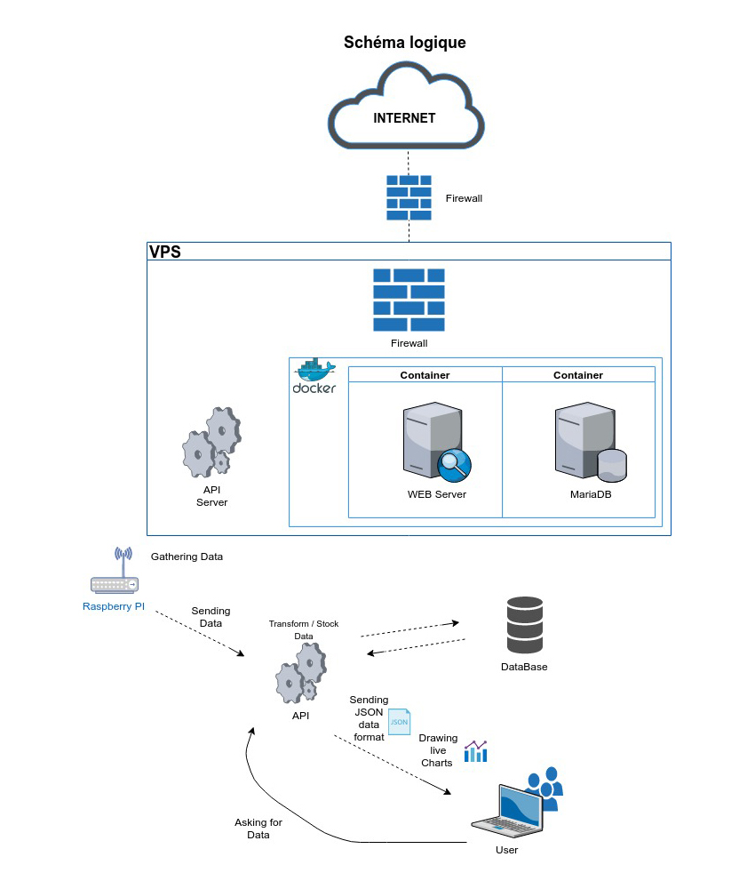

# Description du projet

Ce projet consiste en l'intégration des différents techniques afin d'arriver à un système de partage de graine qui aidera les futurs agriculteurs amateurs.
Le site étant gratuit, nos clients auront la possibilité d'accéder au maximum des ressources mises à leur disposition afin de trouver les graines parfaites pour leur potager.

Un appareil de suivi de la température et de l'humidité de leur serre sera proposé pour tout client désireux de suivre plus en détail leur potager et ainsi optimiser au mieux la pousse et les récoltes.
Cet appareil sera peu encombrant et ne nécessitera que d'un câble d'alimentation ainsi que d'un accès à internet.

## Liens utiles et outils

Concernant ce projet, voici les liens et outils que nous nous servont :

* _**Organisation GitHub**_ : <https://github.com/seed-IT>
* _**Trello**_ : <https://trello.com/b/XEX3CKmq>
* _**Docker Hub**_ : <https://cloud.docker.com/repository/docker/melvinmajor/seed-it>

Nous avons par ailleurs utilisé un groupe de communication privé dans _**Microsoft Teams**_, tout comme _**Clockify**_ comme outil de timesheet.

Notre projet est accessible à l'adresse suivante : <http://www.seed-it.eu/>

\pagebreak

# Bilan du Sprint

## Avancement technique

//TODO

## Méthodologie et gestion d'équipe

//TODO

## Analyse réflexive du fonctionnement du groupe

//TODO

\pagebreak

# Objectifs du Sprint

Le nombre de points accordé est lié à la difficultée et, par conséquent, au temps à devoir consacrer pour mener à bien ce _Story_.

## User Stories

### User Stories en cours

* US : En tant que visiteur du site web _(enregistré)_, j’ai la possibilité de filtrer les offres en fonction de différentes catégories : fleur ou plante, fruit ou légume.
* US : En tant qu'utilisateur, je veux voir les contenu des offres avant de les choisir.
* US : En tant que visiteur du site web _(enregistré et abonnement Tulipe)_, j’ai la possibilité d’effectuer 10 échanges de semences par mois.
* US : En tant qu'utilisateur du site web _(non enregistré)_, j'ai la possibilité de voir les différents plans tarifaires _(gratuit, Tulipe, Rose)_ et leurs particularités.
* US : En tant que visiteur du site web _(enregistré - gratuit)_, j’ai la possibilité de voir 3 offres disponibles.
* US : En tant que visiteur du site web _(enregistré et abonnement Rose)_, j’ai la possibilité d’effectuer un nombre illimité d'échange de semences par mois et recevoir l’appareil de suivi de mes graines.

* US (ThermoPi) : En tant qu’utilisateur de l’appareil de suivi de mes graines j'ai la possibilité de voir le graphique sur le site web.

### User Stories à prendre en charge

* US : En tant que visiteur du site web _(enregistré et sous abonnement Tulipe ou Rose)_, j’ai la possibilité d’accéder à des conseils sur les bonnes pratiques à suivre concernant les graines que j’ai ou qui m’intéressent.
* US : En tant que visiteur du site web _(enregistré)_, j’ai la possibilité de souscrire à l’abonnement premium, PiMium ou de résilier mon abonnement pour revenir à l’offre gratuite.

* US (ThermoPi) : En tant qu’utilisateur de l’appareil de suivi de mes graines _(enregistré et abonnement Rose)_, j’ai la possibilité de suivre les données de l’appareil via le site web.

## Technical Stories

* TS : Schéma réseau _(Sprint 5, 2 points)_
  * _**Responsable :**_ Filipp Shatskiy
  * _**Description :**_ Création du schéma réseau
  * _**Tâche :**_ Création du schéma réseau visant à être inclus dans le rapport et le wiki.
* TS : Schéma base de données _(Sprint 5, 4 points)_
  * _**Responsables :**_ Constantin Mirica, Nathan Henry
  * _**Description :**_ Création du schéma de la base de données (Entité-Relation)
  * _**Tâche :**_ Création du schéma base de données visant à être inclus dans le rapport et le wiki.
* TS : Finalisation du Business Plan _(Sprint 5, 3 points)_
  * _**Responsable :**_ Constantin Mirica
  * _**Description :**_ Finalisation du Business Plan sur base des modifications apporté courant des précédents Sprint.
  * _**Tâches :**_
    * Reparcourir le Business Plan et apporter les adaptations nécessaires pour correspondre à l'évolution du projet,
    * Ajout de parties complémentaires concernant le côté Green-IT.
* TS : Gestion des exceptions lié à l'API _(Sprint 5, 5 points)_
  * _**Responsables :**_ Melvin Campos Casares, Hubert Van De Walle
  * _**Description :**_ Finalisation de la gestion des exceptions lié à l'API lors de la communication réalisée entre la Raspberry Pi et l'API
  * _**Tâches :**_
    * Echange des dernières modifications sur l'API,
    * Mise en place des exceptions et gestion de stockage temporaire des données avant nouvelle tentative d'envoi.
* TS : Optimisation du code de la Raspberry Pi _(Sprint 5, 10 points)_
  * _**Responsables :**_ Melvin Campos Casares, Constantin Mirica
  * _**Description :**_ Optimisation du code de la Raspberry Pi afin de le rendre plus performant
  * _**Tâches :**_
    * Modification pour que le code Python inclus une session,
    * Possible intégration de flags pour démarrer le code avec d'autres paramètres que ceux par défaut (URL vers l'API et durée avant nouvelle prise de mesure),
    * Vérification des import globales et locales afin de ne charger que le nécessaire.
* TS : Finalisation de l'API _(Sprint 5, 6 points)_
  * **Responsable :** Hubert Van De Walle
  * **Description :** Finalisation de l'API servant à l'intercommunication entre le site internet et la base de données.
  * **Tâche :** Création de toutes les méthodes GET et POST nécessaires avec la base de données, l'appareil de suivi et le site internet.
* TS : Reverse Proxy _(Sprint 5, 8 points)_
  * **Responsables :** Hymed Boussaklatan, Hubert Van De Walle
  * **Description :** Implémentation d'un nouveau Reverse Proxy plus performant et plus sécurisé
  * **Tâche :** Mise en place d'un nouveau Reverse Proxy adapté pour le site web, la base de données et l'API.
* TS : Finalisation du site web _(Sprint 5, 12 points)_
  * **Responsables :** Hymed Boussaklatan, Antoine Hoebaer
  * **Description :** Finalisation du site web
  * **Tâches :**
    * Correction des derniers bugs et mise en production des derniers correctifs de modules en test,
    * Création de la page de présentation des différentes formules _(gratuit, Tulipe et Rose)_,
    * Finalisation des filtrages pour la boutique.
* TS : Finalisation du design du site web _(Sprint 5, 5 points)_
  * **Responsables :** Antoine Hoebaer, Hymed Boussaklatan
  * **Description :** Finalisation du design du site web par rapport aux dernières implémentations dans la partie production du site
  * **Tâche :** Modifications des derniers bugs possiblement rencontré avec le Responsive Design du site web.

## Bug

Le dernier CSS mis en place en fin de Sprint 2 est _Responsive Design_ mais apparemment incompatible avec le service web même si totalement fonctionnel en local.
Antoine Hoebaer est en charge de l'évolution du CSS en attendant que la version finale du site web soit créé.
Lors des derniers Sprint, les _Sprint 4 et 5_, le CSS à été intégralement pris en main et est à 80% _Responsive Design_ mais surtout, il est intégralement accessible pour les personnes mal-voyantes ou nécessitant le mode d'accessibilité.

* BUG : CSS final du site web adapté à la nouvelle architecture du site web _(Sprint 4-5, 3 points)_
  * _**Responsable :**_ Hymed Boussaklatan
  * _**Description :**_ Finalisation de la partie CSS du site web sur base de la version finale du site web développé
  * _**Tâches :**_
    * Ajout des id et classes nécessaires pour toutes les pages implémentées et la nouvelle structure mise en place,
    * Vérification de la compatibilité avec la structure du service web,
    * Ajout d'un mode d'accessibilité pour les utilisateurs nécessitant de cela.

\pagebreak

# Timesheet

Les autres membres du groupe ont travaillé mais n'ont pas fourni à temps leur timesheet.
Cela sera reglé pour le prochain Sprint.

| Nom | Date | Durée | Description |
|-----|------|-------|-------------|
| Melvin | 21/11/2019 | 00:28:00 | Intégration des modules complémentaires et du workaround de setuptools pour le launcher du capteur |
| Nathan | 21/11/2019 | 02:30:00 | Web + bdd |
| Melvin | 21/11/2019 | 00:15:00 | Technical Stories du Sprint 5 dans le Trello |
| Melvin | 21/11/2019 | 02:04:12 | Mise en place des logs |
| Hymed | 22/11/2019 | 06:00:00 | Gestion des utilisateurs (login-register) |
| Hymed | 23/11/2019 | 05:50:00 | Tag-récupération des données |
| Melvin | 24/11/2019 | 00:25:00 | Raspberry Pi : cleanup + update |
| Melvin | 26/11/2019 | 00:17:00 | BME280 : Debogage + correctif du problème du timeout à l'envoi du serveur + test |
| Melvin | 26/11/2019 | 00:10:00 | Gestion de renouvellement jusqu'à la présentation et défense du projet |
| Nathan | 27/11/2019 | 00:55:00 | Trello & Github |
| Antoine | 27/11/2019 | 00:05:39 | Correction menu seed-it |
| Filipp | 27/11/2019 | 01:02:00 | Schéma réseau |
| Constantin | 27/11/2019 | 07:04:23 | Analyse rapport business |
| Melvin | 28/11/2019 | 01:12:00 | Ajout d'arguments au lancement du programme Raspberry Pi |
| Nathan | 28/11/2019 | 02:08:35 | Base de données |
| Constantin | 29/11/2019 | 00:49:59 | Tester fonctionnalités php |
| Hubert | 29/11/2019 | 02:54:45 | API |
| Constantin | 30/11/2019 | 00:32:14 | Réunion |
| Hubert | 30/11/2019 | 01:04:00 | API |
| Hymed | 30/11/2019 | 06:00:00 | Création des prime et admin |
| Hubert | 01/12/2019 | 00:59:00 | API modules |
| Nathan | 01/12/2019 | 01:31:00 | Traduction BDD |
| Hubert | 01/12/2019 | 02:00:00 | API id param for sensor request |
| Hubert | 01/12/2019 | 00:13:00 | API blueprint update |
| Hubert | 01/12/2019 | 02:29:00 | API data persistance |
| Hymed | 02/12/2019 | 03:00:00 | Liste et filtre pour les posts |
| Nathan | 02/12/2019 | 00:11:00 | Adding column |
| Nathan | 02/12/2019 | 01:43:00 | Vérification des fichiers |
| Hymed | 02/12/2019 | 05:11:51 | Liste et filtre pour les posts |
| Constantin | 02/12/2019 | 01:24:14 | vérification des fonctions PHP |
| Melvin | 02/12/2019 | 00:56:43 | Documentation et ajout d'un log rotate (stockage max 30 jours) |
| Nathan | 03/12/2019 | 01:35:00 | Vérification des fichiers |
| Nathan | 03/12/2019 | 01:12:00 | Ajout de tables |
| Nathan | 04/12/2019 | 00:36:13 | Vérification des fichiers |
| Antoine | 04/12/2019 | 05:00:00 | correction affichage des prix + création page web RGPD |
| Nathan | 04/12/2019 | 01:00:00 | Page confirmation |

## Réunions

* 20/11/2019 : Réunion entre tous les membres du projet
  * _Durée :_ 3 heures.
  * Mise en commun du Sprint 5, des choses à réaliser et des tâches à se répartir.
* 27/11/2019 : Réunion entre tous les membres du projet
  * _Durée :_ 3 heures.
  * Mise en commun de l'évolution du Sprint 5 sur les parties en cours.
    Séparation des User Stories par membre unique au lieu de User Stories pour plusieurs membres.

\pagebreak

# Schémas et analyses

Certaines modifications étant à apporter, les schémas et analyses à jour sont pour le moment contenu dans le **Business Plan** mais nous comptons l'inclure dans le dernier rapport de Sprint.

# Tests

La partie front-end du site web à été testé via l'outil de développement de Google Chrome et Mozilla Firefox.
En effet, ces deux navigateurs n'interagissent pas exactement de la même manière avec les sites internet et c'est ainsi que nous avons remarqué certaines optimisations à apporter dans la partie _Responsive Design_ concernant les écrans de petites tailles.
Suite à de problèmes d'incompatibilité avec la structure du service web, certains tests complémentaires sont à mettre en place.

De plus, des tests unitaires ont été utilisé pour la partie API afin de s'assurer de son bon fonctionnement.

\pagebreak

# Equipe

Avant de commencer le partage de tâches, nous avons fait le test du DISC qui consiste à analyser les types de comportement de chaque membre.
Nous trouvons que c'est essentiel de mettre en avant les points forts et essayer même d'améliorer les points faibles des membres de notre groupe.

Avant même la conceptualisation du projet et du brainstorm, nous avons mis ensemble en groupe restreint afin d’analyser les qualités et les différents profils dont nous avons besoin dans une équipe capable de surmonter tout projet.

Premièrement l’équipe nécessitait une charte bien définie avec tous les postes disponibles et les responsabilités bien encadrées.
Pour faire cela, nous nous sommes basés sur l’intégralité des autres projets réalisés et sur un squelette hypothétique de notre idée.
Suite à cette analyse nous concluons que les besoins RH sont les suivants :

* Responsable communication
* Responsable équipe
* Responsable marketing
* Responsable web
* Responsable IoT
* Responsable virtualisation
* Responsable sécurité

Deuxièmement nous avons choisi des coéquipiers qui sont très doués dans leurs domaines, deux, trois par poste, afin de faire une sélection plus précise.
Après des négociations pour les différents postes nous avons su allouer les places, en fonction des tests de leurs personnalités.

Notre équipe n’est pas faite à base d’amitié mais à base de confiance, efficacité, et mélange équilibré de toutes les personnalités :

| J     | V    | R     | B    |
|-------|------|-------|------|
| Jaune | Vert | Rouge | Bleu |

* Communication : Melvin _(JV)_ - Product Owner
* Equipe : Constantin _(BV)_ - Scrum Master
* Marketing : Filipp _(JV)_
* Web : Antoine _(JV)_
* IoT : Nathan _(VB)_
* Virtualisation : Hymed _(RJ)_
* Sécurité et API : Hubert _(RB)_

La colorimétrie correspond au test de personnalité DISC et comme vous pouvez le remarquer, nous avons choisi un seul membre qui a une personnalité plus « vive », car suite à nos analyses c’est le meilleur choix.

## Estimation de la vélocité de l'équipe

//TODO

## Forces et faiblesses du sprint précédent et mesures prises

//TODO

### Forces

//TODO

### Faiblesses

//TODO

# Objectif du prochain Sprint

Il n'y a plus de Sprint de prévu.

Nous présenterons la version finale du projet lors de la défense du projet d'intégration.
